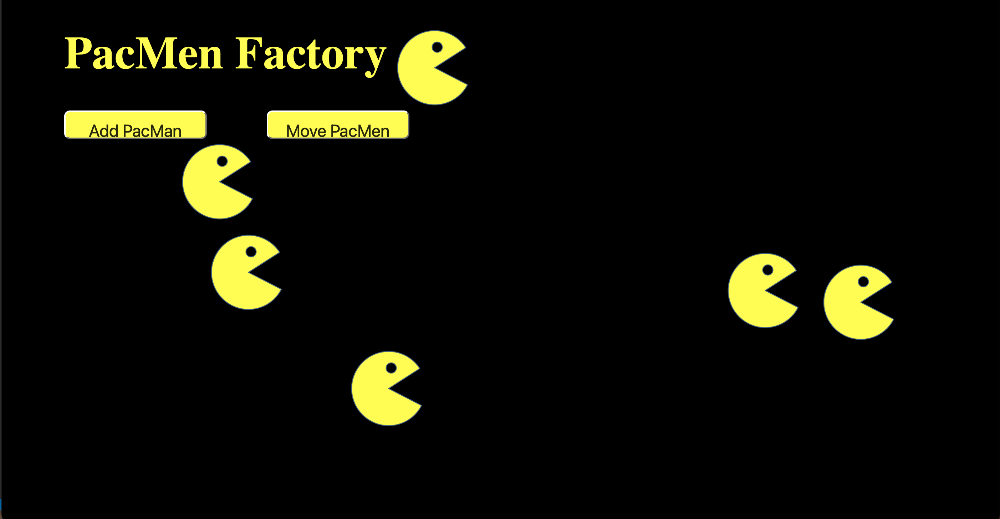

# PacMen Factory 
Factory for making pacMen  

## Description
In order to code the PacMen factory, two buttons were created. The "Add PacMan" button positions the PacMan image on the screen which is stored in the update function. When the "Move PacMan" button is clicked, the PacMen are added to an array which will keep track of the position and velocity of each PacMan within the move function. This code also demostrates the ability of the PacMen to bounce off the walls due to wall detection.  
## Installation 
Download a copy of the PacMen Factory repo. Drag and drop PacMan.Html onto a blank webpage and load the page. You should see an empty PacMen Factory. Press the buttons to create and move the factory.

## Usage
This project is a good example of working with the DOM, arrays, conditional statements and call back functions. 

## Support
[MDN Web Docs](https://developer.mozilla.org/en-US/docs/Web/JavaScript)

## Roadmap
The future goal for this project's improvement and growth is to have the image change once PacMan bounces off the wall to face the corresponding direction.
## License Information
MIT 
